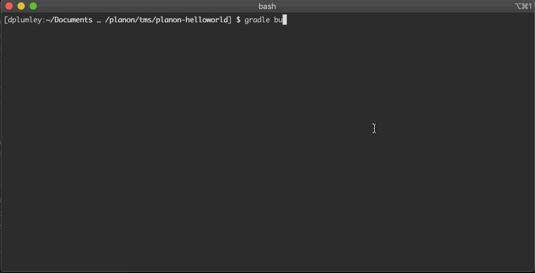

# Setup

1. Setup Gradle project

    ```shell
    mkdir helloworld
    cd helloworld
    gradle init --type java-library --dsl groovy --test-framework junit --project-name HelloWorld --package edu.dartmouth.bt.planon.helloworld.sx

    mkdir lib

    curl https://www.gitignore.io/api/java,macos,gradle,visualstudiocode > .gitignore
    echo ".vscode*" >> .gitignore
    ```

2. Add class dependencies to lib/
3. In gradle.build dependencies {} add class file references
    1. *EXAMPLE*: **compile files('lib/com.planonsoftware.ux.api.v1-2.2.1.0-1.jar')**
4. Change *Library.java to the desired class name
    1. *EXAMPLE*: **HelloWorld.java**
5. The class should implement IUserExtension and the executeUX() and getDescription() methods
    1. *EXAMPLE*:

        ```java
        package edu.dartmouth.bt.planon;

        import nl.planon.hades.userextension.uxinterface.*;

        public class HelloWorld implements IUserExtension {
            private String description = "This is the description that is shown to administrators in the Planon web client.";

            public HelloWorld() {}

            public void executeUX(IUXBusinessObject newBO,IUXBusinessObject oldBO, IUXContext context, String parameter) {
                // do stuff
            }

            public String getDescription() {
                return description;
            }
        }
        ```

6. Configure gradle to build the JAR and provide the required manifest information

    ```groovy
    jar {
        baseName = 'helloworld'
        version = '0.0.2'
        manifest {
            attributes (
                'Manifest-Version': '1.0',
                'Bundle-SymbolicName': 'Dartmouth-HelloWorld',
                'Planon-UserExtension': '1.0.0',
                'Planon-IUserExtension': 'edu.dartmouth.bt.planon.HelloWorld',
                'Import-Package': 'nl.planon.hades.userextension.uxinterface'
            )
        }
    }
    ```

7. Set your JDK path as needed using the **gradle.properties** file
    1. *EXAMPLE*: **org.gradle.java.home=/Library/Java/JavaVirtualMachines/adoptopenjdk-8.jdk/Contents/Home/**
8. Use gradle to build the JAR

    ```shell
    gradle build
    ```

    

9. Copy the resulting JAR from **build/libs/** to the **/tms/upload/jboss** folder on the Planon server
10. You should see **server.log** entries similiar to the following if your package loaded correctly

    ```shell
    2019-10-15 15:04:34,355 INFO  [pnlog.NONE.com.planonsoftware.platform.ux.v1.adapter.UXAdapter] (fileinstall-/var/lib/openshift/5da0cd38e3c9c3d6bb000b7f/planon/PlanonProCenter/wildfly-10.1.0.Final/standalone/bundles/planon) User Extension bundle Dartmouth-HelloWorld is installing...
    2019-10-15 15:04:34,358 INFO  [pnlog.NONE.com.planonsoftware.platform.ux.v1.adapter.UXAdapter] (fileinstall-/var/lib/openshift/5da0cd38e3c9c3d6bb000b7f/planon/PlanonProCenter/wildfly-10.1.0.Final/standalone/bundles/planon) User Extension bundle 'Dartmouth-HelloWorld' is installed.
    2019-10-15 15:04:34,358 INFO  [pnlog.DEFAULT.nl.planon.hades.osgi.platform.OSGIContainer] (fileinstall-/var/lib/openshift/5da0cd38e3c9c3d6bb000b7f/planon/PlanonProCenter/wildfly-10.1.0.Final/standalone/bundles/planon) Bundle: Dartmouth-HelloWorld (0.0.0) is started.
    ```
